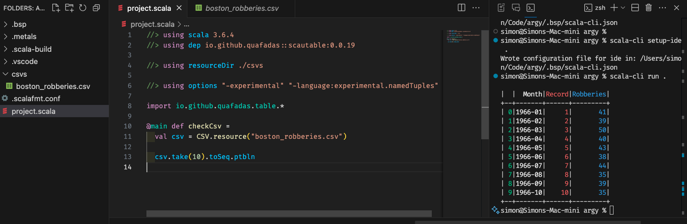

# Introduction

At heart, the concept here is building yet-another dataframe-esque library.

There are existing, excellent solutions:
- https://pandas.pydata.org
- https://spark.apache.org/docs/latest/sql-getting-started.html
- https://www.rdocumentation.org/packages/base/versions/3.6.2/topics/data.frame

## So, why?

My experience has been that the existing scala solutions tend to be heavyweight (see spark) or, require you to _know_ the schema ahead of time (fs2-data, is none-the-less a great library). Our target USP, is one line, statically typed data import so that you can get started on a CSV file right from your script. It should heolp you discover the schema, in extremis without needing to open the file and figure out what is actually in there, first.

## How?

The initial experiment here showed (I believe) some promise. Scala's `@experimental NamedTuple` appears well suited to the task. The last I read, the hope is that it will no longer be experimental come scala 3.7.0.

In combination with a macro, we can generate a type signature for a `NamedTuple` from the CSV file _at compile time_. As far as I can tell, type inference works well from that point onwards. So, we can wheel in the scala stdlib to do an astonishing amount of heavy lifting. We need only to encourage people to think of a collection of `NamedTuple` as a table, I claim a relatively easy mental leap.

## Status

So we have a promising experiment, which lacks polish.

### Task List

I would like to put a lot of emphasis on making the experience of writing that very first line of code a consumer of the library writes as smooth and as rich and reliable as possible.

```scala
//> using scala 3.6.4
//> using dep io.github.quafadas::scautable:0.0.19
//> using resourceDir ./csvs

// Hopefully, these disappear in future
//> using options "-experimental" "-language:experimental.namedTuples"

import io.github.quafadas.table.*

@main def checkCsv =
  def csv = CSV.resource("boston_robberies.csv")

  csv.take(10).toSeq.ptbln

```


Find a CSV file and give it a go! Did this work for you? Any pain points? Any suggestions?

I think we should target two environments, [scala-cli](https://scala-cli.virtuslab.org) and [almond](https://almond.sh). The script above should work for scala-cli.

I believe the most important next step is to find and fix "import failures". What if a row has the wrong number of entries? What if a column is missing from a row? Does the "import" remain robust? _Should_ it remain robust? Does a consumer get good error messages?

Can we handle large CSVs? Up to a million rows seems to have worked okay for me - is there a bound? As we do the import at compile time, does the file size impact compiler speed? Can we measure that?

What about a CSV with 10,000 _columns_?

What if there are no headers?

What if the headers are malformed?

What if the headers are not unique?

Can you get it working in almond? Let's work it through together and document that journey.

## Success!
Whilst unglamorous, I believe answers to the questions above dictate long term viability. Providing a test suite answering them would be the primary goal of the project and my proposed success criteria.

### Fun extensions

Once the data is in, we want to have (stdlib based) fun with it!


Try and write this out by hand. Did you get help from the tooling? Any rough edges? Have a look at `groupMapReduce`, `groupBy`, `sliding`, etc. Can you think of a way to write a generic helper for basic stats?

How did you know that the robberies column was an `Int`? How could we generate column summaries a la pandas? Can we map columns to an inferred type without requiring user intervention?

After that point, I see great potential for a wide variety of diagnostic helper methods.

I believe that ideally, helpers would arrive in two flavours - one for collections which are "materialised" (i.e. have had a `.toSeq` or similar called on them), and one set which are "streaming" (i.e. remain lazy).

## Other data sources

Depending on if you have a usecase, we could look at importing other data sources in the same way - e.g. SQL. I think the same principles would apply.

### Plotting

Is important if we can get to this stage. I have ideas on the approach once the diagnostics are in place.

### Bonus: Asyncrony

What about if we want to have async (e.g. a webrequest) per row? Can we find a way to deal with that by adding a column? How do we get at the results. The answer, is probably traverse...


