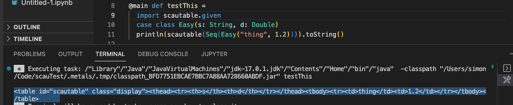
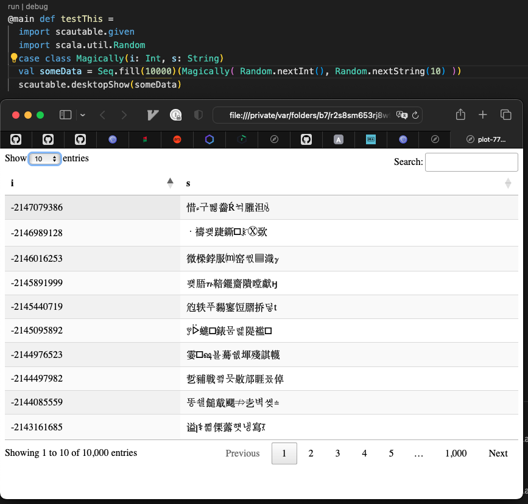
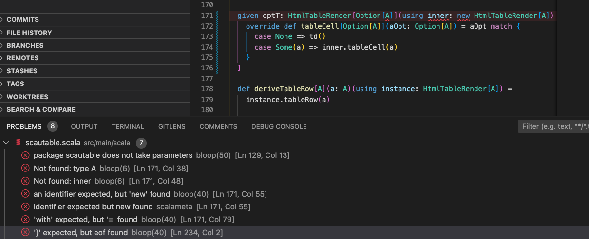

# SCala AUto TABLE

- Strongly typed compile-time CSV
- pretty printing to console for `Product` types
- Auto-magically generate html tables from case classes
- Searchable, sortable browser GUI for your tables

## Elevator Pitch
Insta-auto-magically generate a [scalatags](https://github.com/com-lihaoyi/scalatags) table from a `Seq[A]` (case classes).

with scala-cli
```
//> using lib "io.github.quafadas::scautable:0.0.5"
@main def testThis =
  import scautable.{*,given}
  case class Easy(s: String, d: Double)
  println(scautable(Seq(Easy("thing", 1.2)))).toString()
```


### Desktop
Pimp your html table with [https://datatables.net](datatables.net)



### Almond


### Scala JS
It cross compiles, and gives you back a scalatags table

## Infrequently Asked Questions
### Is this project a good idea
Unclear. One of it's purposes is to push the boundary of my metaprogramming knowledge. If you use this, it exposes you to the very real risk of frustration to the reality that this is an educational project I run on my own time.

### How does it work

The macro stuff came from smashing my head against chatGPT and a wall. A lot.

The table derivation stuff comes from here;
I aggressively copy pasted everything from here and poked it with a sharp stick until it did what I wanted.
https://blog.philipp-martini.de/blog/magic-mirror-scala3/

### Limitations

For CSVs, type inference...

See tests;
- Formatting is implied by the type. To format your own types, you'll need to write a given for it.
- Extension is through the type system, have a look at the JVM tests for an example if writing a given for your own custom type
- As I don't _really_ understand how it works, it's unlikely to get extended further...
- Extending it further is probably a really bad idea anyway

// TODO: Docs

// TODO: Sample (graduated)