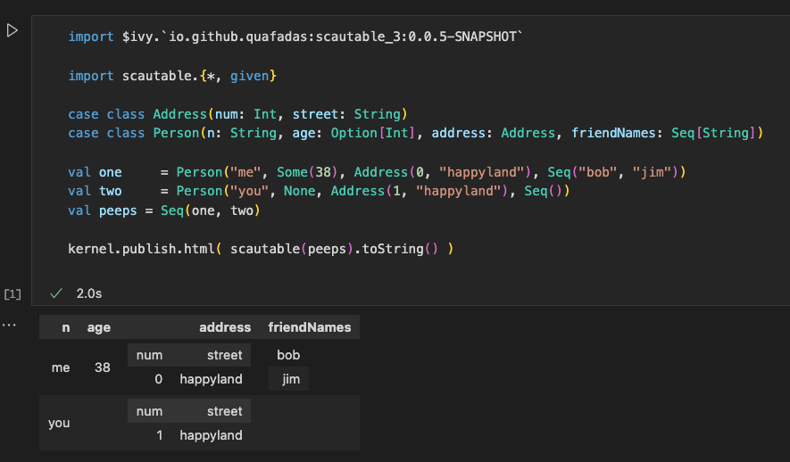

# SCala AUto TABLE
Auto-magically generate html tables from case classes

## Elevator Pitch 
Insta-auto-magically generate a [scalatags](https://github.com/com-lihaoyi/scalatags) table from a `Seq[A]` (case classes). 

with scala-cli
```
//> using lib "io.github.quafadas::scautable:0.0.5"
@main def testThis = 
  import scautable.{*,given}  
  case class Easy(s: String, d: Double)
  println(scautable(Seq(Easy("thing", 1.2)))).toString()
```


### Desktop
Pimp your html table with [https://datatables.net](datatables.net)


### Almond


### Scala JS
It cross compiles, and gives you back a scalatags table

## Infrequently Asked Questions
### Is this project a good idea
Unclear. But I wanted to play with Mirrors. 

### How does it work
I aggressively copy pasted everything from here and poked it with a sharp stick until it did what I wanted.
https://blog.philipp-martini.de/blog/magic-mirror-scala3/

### Limitations
See tests; 
- Formatting is implied by the type. To format your own types, you'll need to write a given for it.
- Extension is through the type system, have a look at the JVM tests for an example if writing a given for your own custom type
- As I don't _really_ understand how it works, it's unlikely to get extended further... 
- Extending it further is probably a really bad idea anyway