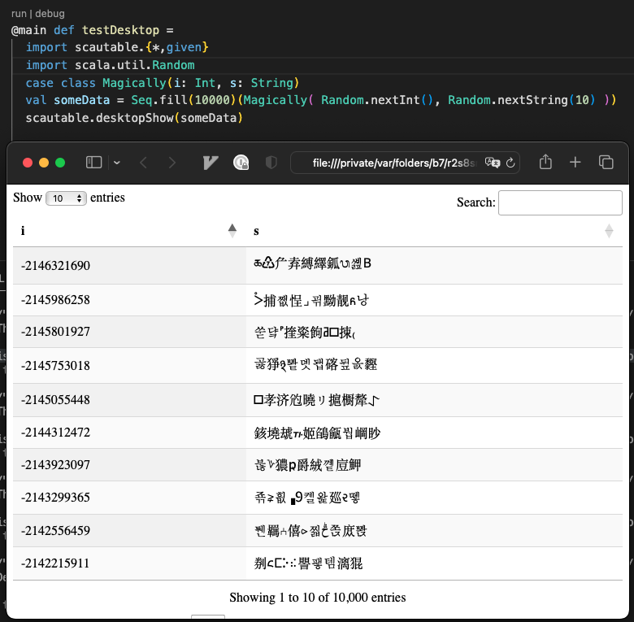

# Import

```scala

//> using dep io.github.quafadas::scautable:{{projectVersion}}

```

# Elevator Pitch - {{projectTitle}}

{{projectVersion}}

```scala mdoc
import scautable.{*, given}

case class ScauTest(anInt: Int, aString: String)
scautable(
  Seq(ScauTest(1, "one"), ScauTest(2, "two")),
  true
).toString()
```

On the JVM in particular, the ability to pop it open in the browser, see and search the actual data... can be useful. Particularly if you're working with a lot of mesy, csv data for example.

```scala
import scautable.{*, given}

case class ScauTest(anInt: Int, aString: String)
val soComplex = Seq(ScauTest(1, "one"), ScauTest(2, "two"))

scautable.desktopShow(soComplex)
```
Will pop open a browser... using https://datatables.net


And your case classes are now easily visible and searchable.

# Scala JS

I love scala JS, so it cross compiles, and gives you back a scalatags table. This is of questionable usefulness, but it's fun.

TODO : Laminar integration, which nobody wants but would be cool.